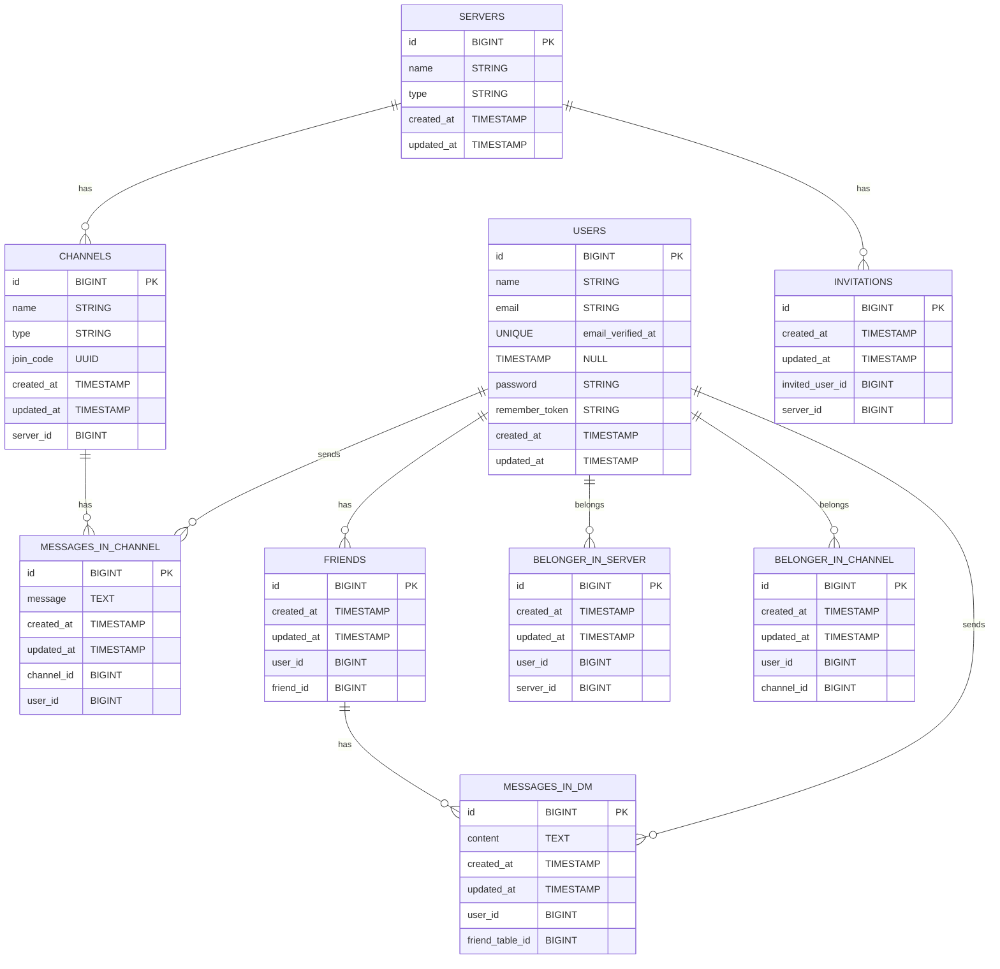

```mermaid
erDiagram
    USERS {
        id BIGINT PK
        name STRING
        email STRING UNIQUE
        email_verified_at TIMESTAMP NULL
        password STRING
        remember_token STRING
        created_at TIMESTAMP
        updated_at TIMESTAMP
    }

    SERVERS {
        id BIGINT PK
        name STRING
        type STRING
        created_at TIMESTAMP
        updated_at TIMESTAMP
    }

    CHANNELS {
        id BIGINT PK
        name STRING
        type STRING
        join_code UUID
        created_at TIMESTAMP
        updated_at TIMESTAMP
        server_id BIGINT
    }

    MESSAGES_IN_CHANNEL {
        id BIGINT PK
        message TEXT
        created_at TIMESTAMP
        updated_at TIMESTAMP
        channel_id BIGINT
        user_id BIGINT
    }

    FRIENDS {
        id BIGINT PK
        created_at TIMESTAMP
        updated_at TIMESTAMP
        user_id BIGINT
        friend_id BIGINT
    }

    BELONGER_IN_SERVER {
        id BIGINT PK
        created_at TIMESTAMP
        updated_at TIMESTAMP
        user_id BIGINT
        server_id BIGINT
    }

    BELONGER_IN_CHANNEL {
        id BIGINT PK
        created_at TIMESTAMP
        updated_at TIMESTAMP
        user_id BIGINT
        channel_id BIGINT
    }

    MESSAGES_IN_DM {
        id BIGINT PK
        content TEXT
        created_at TIMESTAMP
        updated_at TIMESTAMP
        user_id BIGINT
        friend_table_id BIGINT
    }

    INVITATIONS {
        id BIGINT PK
        created_at TIMESTAMP
        updated_at TIMESTAMP
        invited_user_id BIGINT
        server_id BIGINT
    }

    USERS ||--o{ FRIENDS : has
    USERS ||--o{ MESSAGES_IN_CHANNEL : sends
    USERS ||--o{ MESSAGES_IN_DM : sends
    USERS ||--o{ BELONGER_IN_SERVER : belongs
    USERS ||--o{ BELONGER_IN_CHANNEL : belongs
    FRIENDS ||--o{ MESSAGES_IN_DM : has
    SERVERS ||--o{ CHANNELS : has
    SERVERS ||--o{ INVITATIONS : has
    CHANNELS ||--o{ MESSAGES_IN_CHANNEL : has

```
