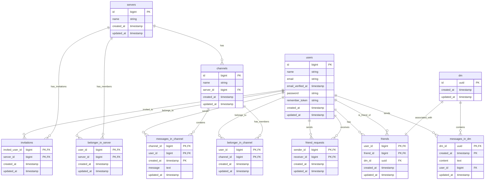

```mermaid
erDiagram
    users {
        id bigint PK
        name string
        email string
        email_verified_at timestamp
        password string
        remember_token string
        created_at timestamp
        updated_at timestamp
    }

    servers {
        id bigint PK
        name string
        created_at timestamp
        updated_at timestamp
    }

    invitations {
        invited_user_id bigint PK,FK
        server_id bigint PK,FK
        created_at timestamp
        updated_at timestamp
    }

    friend_requests {
        sender_id bigint PK,FK
        receiver_id bigint PK,FK
        created_at timestamp
        updated_at timestamp
    }

    dm {
        id uuid PK
        created_at timestamp
        updated_at timestamp
    }

    channels {
        id bigint PK
        name string
        server_id bigint FK
        created_at timestamp
        updated_at timestamp
    }

    messages_in_channel {
        channel_id bigint PK,FK
        user_id bigint PK,FK
        created_at timestamp PK
        message text
        updated_at timestamp
    }

    belonger_in_channel {
        user_id bigint PK,FK
        channel_id bigint PK,FK
        created_at timestamp
        updated_at timestamp
    }

    friends {
        user_id bigint PK,FK
        friend_id bigint PK,FK
        dm_id uuid FK
        created_at timestamp
        updated_at timestamp
    }

    belonger_in_server {
        user_id bigint PK,FK
        server_id bigint PK,FK
        created_at timestamp
        updated_at timestamp
    }

    messages_in_dm {
        dm_id uuid PK,FK
        created_at timestamp PK
        content text
        user_id bigint FK
        updated_at timestamp
    }

    users ||--o{ invitations : "invited_to"
    servers ||--o{ invitations : "has_invitations"

    users ||--o{ friend_requests : "sends"
    users ||--o{ friend_requests : "receives"

    users ||--o{ messages_in_channel : "sends"
    channels ||--o{ messages_in_channel : "contains"

    users ||--o{ belonger_in_channel : "belongs_to"
    channels ||--o{ belonger_in_channel : "has_members"

    users ||--o{ friends : "has"
    users ||--o{ friends : "is_friend_of"
    dm ||--|| friends : "associated_with"

    users ||--o{ belonger_in_server : "belongs_to"
    servers ||--o{ belonger_in_server : "has_members"

    users ||--o{ messages_in_dm : "sends"
    dm ||--o{ messages_in_dm : "contains"

    servers ||--o{ channels : "has"
```
